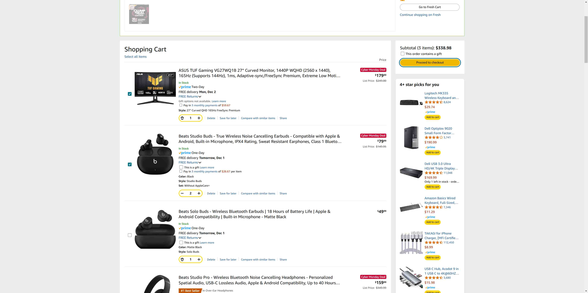
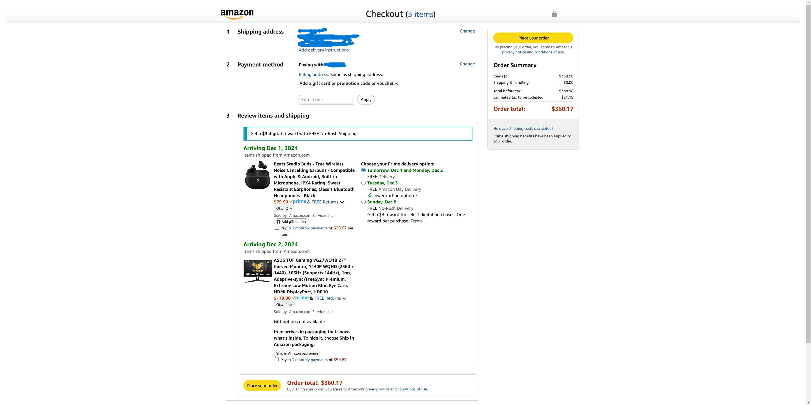

# User Interaction Recorder

This extension is built on top of the [chrome extension typescript starter](https://github.com/chibat/chrome-extension-typescript-starter).

## Introduction

The User Interaction Recorder is a Chrome extension that records user interactions on amazon web pages

## Key Features

- Interaction Recording: Captures user actions: clicks, scrolling, input, and navigation to new pages. Navigation is further categorized into new(new page, ie. clicking on a link), back, forward, and refresh actions. Each action records an HTML snapshot and a screenshot. The action links to the HTML snapshot through the htmlSnapshotId. And the action links to the screenshot through the screenshotId(timestamp).
- Semantic Click Data: For click actions, the extension preloads recipes on the web page. If a clicked element has been processed by the recipe logic, it records a data-clickable-id, serving as semantic information about the user's action.
- Data Export: After performing a set of actions, you can click the extension icon to download the recorded data.
  The data will be saved in a folder named DATA/SESSION\_\<timestamp\> with the following contents: - interactions.json: A JSON file containing recorded interactions and HTML snapshots. - session_info.txt: A text file with session information. - Screenshots: screenshots of the web page at different timestamps. - User ID: The extension allows you to set a user ID, which will be recorded in the session info.

**Note: Please limit the number of actions before downloading to prevent Chrome from freezing due to large amounts of data (each action records an HTML snapshot and a screenshot).**

## Example Recording

This is an example of a recorded interaction where the user clicked the "Proceed to Checkout" button on the shopping cart page. The extension recorded both the click event and the navigation to the new page, and saved the order detail information.

```json
  "interactions": [
    {
      "eventType": "click",
      "timestamp": "2024-11-30T09:21:17.994Z",
      "target": {},
      "targetOuterHTML": "<input name=\"proceedToRetailCheckout\" data-feature-id=\"proceed-to-checkout-action\" class=\"a-button-input\" type=\"submit\" value=\"Proceed to checkout\" aria-labelledby=\"sc-buy-box-ptc-button-announce\" data-clicked=\"1\">",
      "targetClass": "a-button-input",
      "targetId": "",
      "targetText": "Proceed to checkout",
      "htmlSnapshotId": "html_402588164_2024-11-30T09:21:17.995Z",
      "selector": "body.a-m-us.a-aui_72554-c.a-aui_a11y_6_837773-t2.a-aui_amzn_img_959719-c.a-aui_amzn_img_gate_959718-c.a-aui_killswitch_csa_logger_372963-c.a-aui_pci_risk_banner_210084-c.a-aui_template_weblab_cache_333406-c.a-aui_tnr_v2_180836-c.a-bw_aui_cxc_alert_measurement_1074111-t1.a-meter-animate > #a-page > div.a-container.sc-background-dark > #sc-page-content > #sc-retail-cart-container > div.a-fixed-right-grid-inner > #proceed-to-checkout-desktop-container > #sc-buy-box > div.a-cardui-body.a-scroller-none > #gutterCartViewForm > div.a-box-group.sc-buy-box-group > div.a-section.sc-buy-box-inner-box > #desktop-ptc-button-celWidget > #sc-buy-box-ptc-button > span.a-button-inner > input.a-button-input",
      "clickableId": "",
      "url": "",
      "actionSequenceId": 1
    },
    {
      "eventType": "navigation",
      "navigationType": "new",
      "timestamp": "2024-11-30T09:21:19.347Z",
      "target_url": "https://www.amazon.com/gp/cart/desktop/go-to-checkout.html/ref=ox_sc_proceed?oldCustomerId=AA2FVIE792OMZ&preInitiateCustomerId=AA2FVIE792OMZ&partialCheckoutCart=1&tangoWeblabStatus=tango_not_eligible_cart&isToBeGiftWrappedBefore=0&proceedToCheckout=1&cartInitiateId=1732958473632&preInitiateExecutionId=3b55bb6b-1f23635d2462-7e291582ee59-6be1e219.S.C5917KD2XWTFHRV7FX67",
      "htmlSnapshotId": "html_1213105525_2024-11-30T09:21:19.347Z",
      "actionSequenceId": 2
    }
  ],
  "orderDetails": [
    {
      "asin": "B088MKHW7M",
      "name": "ASUS TUF Gaming VG27WQ1B 27” Curved Monitor, 1440P WQHD (2560 x 1440), 165Hz (Supports 144Hz), 1ms, Adaptive-sync/FreeSync Premium, Extreme Low Motion Blur, Eye Care, HDMI DisplayPort, HDR10",
      "options": {
        "Style": "27\" Curved QHD 165Hz FreeSync Premium"
      },
      "price": 179
    },
    {
      "asin": "B096SV8SJG",
      "name": "Beats Studio Buds - True Wireless Noise Cancelling Earbuds - Compatible with Apple & Android, Built-in Microphone, IPX4 Rating, Sweat Resistant Earphones, Class 1 Bluetooth Headphones - Black",
      "options": {
        "Color": "Black",
        "Set": "Without AppleCare+",
        "Style": "Studio Buds"
      },
      "price": 79.99
    }
  ]
```




## How To Use

1. Enable Developer Mode in Chrome Extensions:
   Open Chrome and navigate to chrome://extensions/.
   Enable Developer mode by toggling the switch in the upper right corner.
2. Load the Unpacked Extension:
   Click on Load unpacked.
   Select the `dist`folder containing the extension's files.
3. Configure Download Settings:Go to Chrome settings and disable Ask where to save each file before downloading to allow the extension to save data files automatically.
4. Set User ID: Click on the extension icon and set a user ID. The user ID will be recorded in the session info.
5. Perform Actions: Perform actions on the Amazon web page. The extension will record the actions and save the data.
6. Download Data: Click on the extension icon to download the recorded data.

## Known Issues

currently none?

## For Developers

### Prerequisites

- [node + npm](https://nodejs.org/) (Current Version)

### Project Structure

- src/typescript: TypeScript source files
- src/assets: static files
- dist: Chrome Extension directory
- dist/js: Generated JavaScript files

### Setup & Build

```
npm install
npm run build
```
